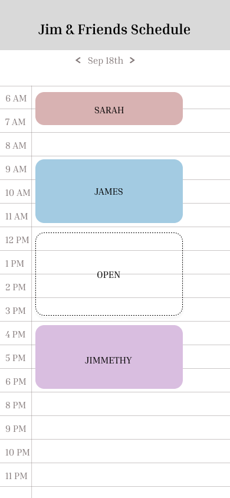

# Shared Calendar

### Elevator Pitch
Shared calendar is a simple web application that allows individuals to easily manage a calendar shared by a single person.
Each person who edits the calendar does not need an account, except for the person who made it - thereby making it
simple to adjust the schedule for all members who may be doing different activities during the week and want to
record the times they're all available so that it is easy to plan things without having to do lots of back and 
forth texting. Eventually, I would also like this to be an app on the webstore and/or ios with a widget feature to
make this even simpler.

### Design

### Key Features
- Only one account needed
- Real time updating
- Accessible by a single link, no login required
- Ability for anyone with the link to add events
- Any area not used is automatically marked as "open"
    - This can be changed in settings
- Different colors for events
- Location data for events and info

### Representing All Technologies
- HTML - Used to layout the basics of the site and provide access to different tabs and such
- CSS - Used to beautify as well as style the different types of events, buttons, and UI layout
- Javascript - Ability to share the link, have people edit events, and have settings and access
to the main calendar for the account owner.
- React - Help everything sync nicely and provide an intuitive layout with CSS
- Services
    - Firebase: For storing data and syncing
    - Others: For link sharing and easy editing of the calendar
- Websocket: As each person changes something, it is instantly changed for all other people with the link as well

### HTML
- Added home page where the users will be able to add and remove events
- Added basic structure and layout for the application
- Added links to the about and discord tabs
- Added an "invite to calenshare" button that will allow users to invite people using a link
- Added a button for the owner of the calendar to login

### CSS (Bootstrap)
- Added a navigation bar and also styled it
- Also added a gradiant styled "Calenshare" to the nav of all pages
- Renamed the login page to "My Calendars" and styled entire page with CSS
- Styled the footer
- Made all pages into a grid format for header-content-footer structure
- Styled the home page and better formatted the calendar
- Also styled the About the Author page

### JS (React)
- Changed the table to a component based table that is modular
- Made it so that the calendar changes based on the link and day entered
- Made it so you can finally add items to the calendar that save!
- Introduced mock login functionality
- Created a link generator
- Added a button on the main page that lets you chose and use a date from the calendar
- Restructured the entire site to use React routing
- Added logout functionality